## Bem-vindos


Este repositório é dedicado a dicas de Jenkins com Docker, Utilização via Jar e também configurar para serviços do Apache Hop.


Não entrarei em detalhes de instalação do Docker, pois há diversos materiais na internet sobre isso.

Partindo do princípio que o Docker está devidamente instalado, vou seguir com o tutorial.


O Jenkins é uma ferramenta amplamente utilizada para fins de Automação, Agendamentos, CI/CD entre outros.

Em nosso caso de estudo vamos utilizar o Jenkins como um Agendados para o Apache Hop.


**Procure utilizar a última versão estável dos programas abaixo.**

- [Jenkins - Documentação de Instalação e Configuração](https://www.jenkins.io/doc/book/installing/)

- [Jenkins - Instalação com Docker](https://www.jenkins.io/doc/book/installing/docker/)

- [Jenkins - Instalação Padrão Windows](https://www.jenkins.io/doc/book/installing/windows/)

- [Jenkins - Instalação Padrão Linux](https://www.jenkins.io/doc/book/installing/linux/)


- [Jenkins - Instalação via War File - Execuação via linha de comando WIndows/Linux](https://www.jenkins.io/doc/book/installing/war-file/)

- [Apache Hop - Download](https://hop.apache.org/download/)


O Apache Hop é baixar, extrair e executar o script: hop-gui.sh para linux e hop-gui.bat para windows.

Repositórios Extras para apoio

- [Preparar um ambiente de Desenvolvimento Apache Hop](https://github.com/pauloricardoferreira/hop_configurar_local_desenvolvimento)

- [Exemplos de Container Apach Hop entre outros](https://github.com/pauloricardoferreira/stack_dados)


**Obs: O Jenkins e o Apache dependem do Java**

## Instalar o jenkins

Faça o Download e coloca na pasta: c:\opt\jenkins

Acesse essa pasta e execute o comando: ``java -jar jenkins.war --httpPort=8080`` para iniciar o serviço do Jenkins.

Uma desvantagem de utilizar essa abordagem é que ao reiniciar ou desligar o computador, você deverá iniciar todos os serviços manualmente.

Após iniciar o serviço, via linha de comando, uma menssagem muito importante será exibida, que é o Password Inicial.

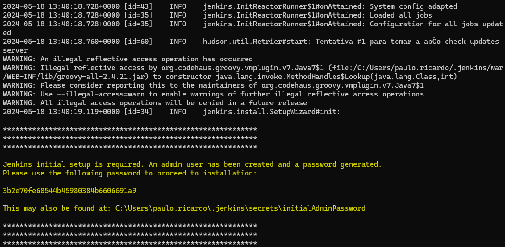

Este fluxo segue para todas as plataformas, e tudo isso está descrito na documentação.

Ao acessar o navegador a página inicial de configuração será exibida, cole o password no local indicado

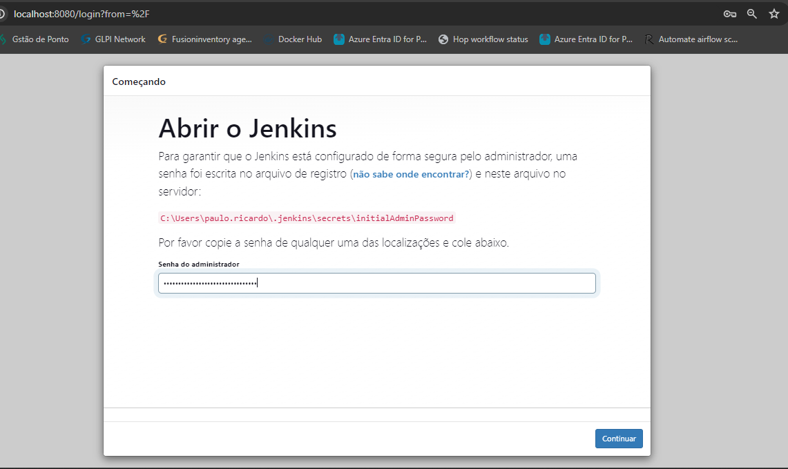

A tela seguinte deve perguntar se deseja seguir com a instalação ou instalar alguma extenção.

O Jenkins possui inpumeras extenções criadas por desenvolvedores independentes e pelo próprio Jenkins.

Vamos seguinte com a instalação padrão.

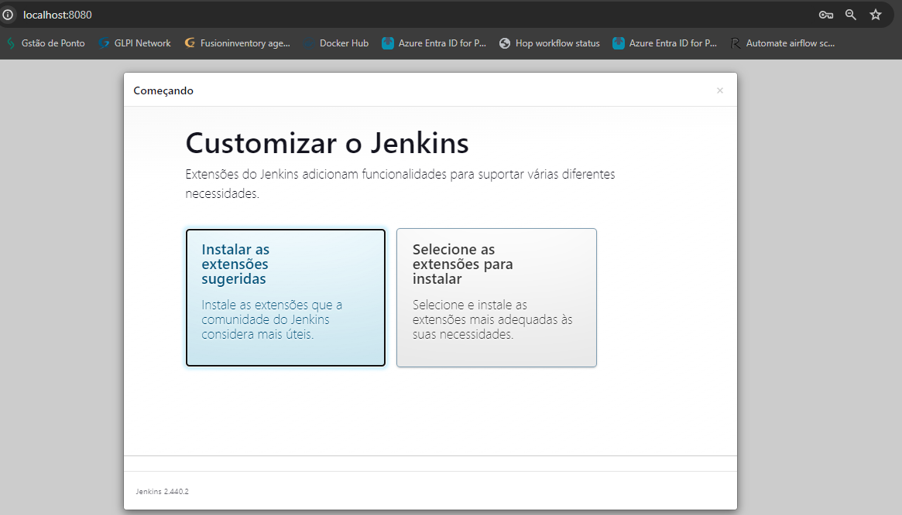

Aguarde a configuração finalizar, e após será direcionado para criar o usuário administrador.

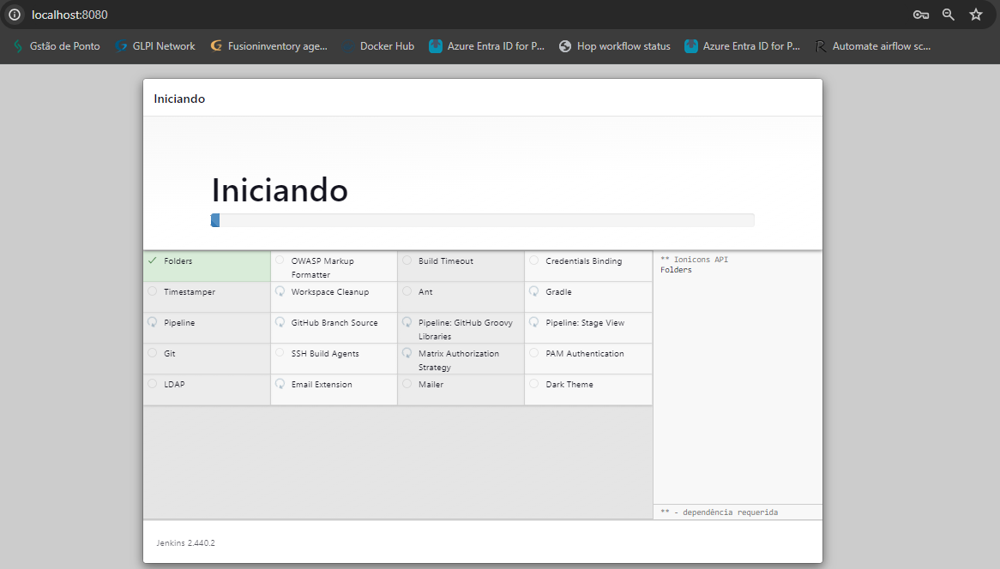


Preencha os dados para criar um usuário que irá administrar o Jenkins

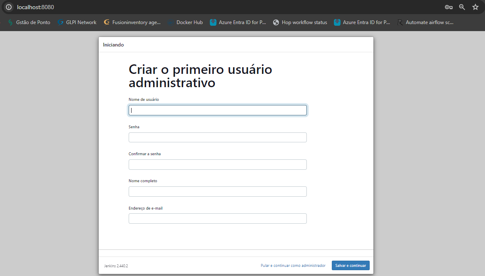


**É possível cadastrar outros usuários e também configurar uma conexão com o LDAP - Central de Cadastro de Usuários**

A tela sugere colocar um IP, ou nome do computador conhecido na rede interna da empresa, ou se tiver um domínio externo para acessar o Jenkins.

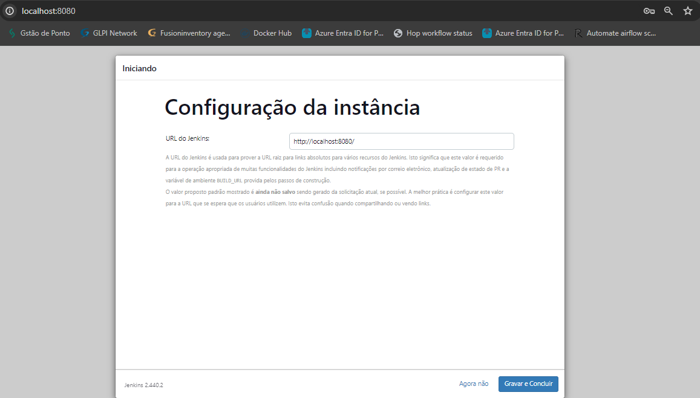

---


```
Não entrarei em detalhes de Administração do Jenkins, quero fazer o básico para que você dar o passo inicial
```
---


## Configurar o Jenkins

Com o Jenkins devidamente instalado, vamos fazer algumas configuracoes para o propósito de Executar um Job do Apache Hop


Na tela Inicial procure por `Gerenciar Jenkins`

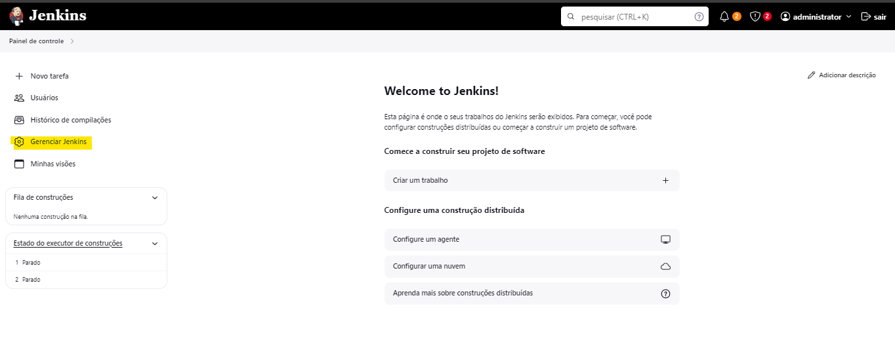

Procure por `System`

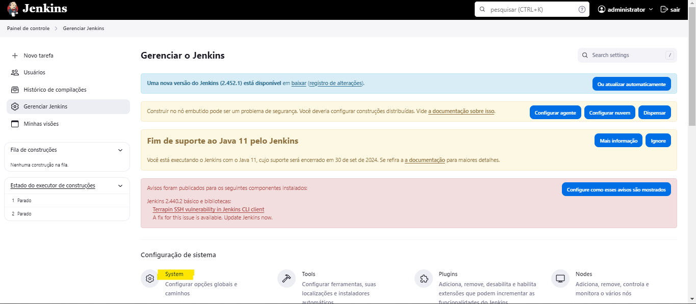

Após selecionar, procure por `Propriedades Globais`.

Aqui é onde iremos definir uma variável gloval que vai apontar para o local de instalação do Apache Hop, desta forma não não precisaremos escrever o caminho toda vez que for contruir um pipeline.

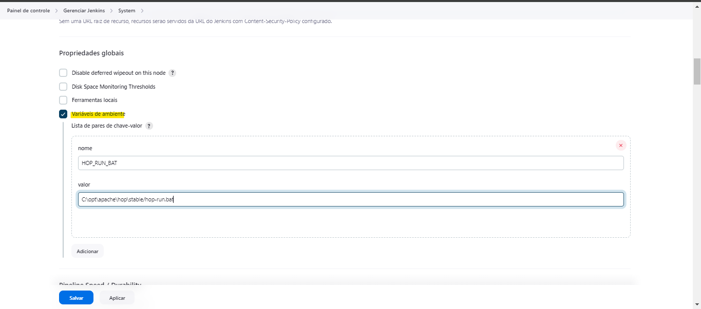

Essas são as configurações básicas de preparação do ambiente.

**Estude a fundo a ferramente, pois ela tem muito a oferecer**

## Preparando seu Primeirio Agendamento

Após realizar as configurações acima, vamos fazer o nosso primeiro agendamentio.

Para isso, volte na tela inicial e clique em `Nova Tarefa`

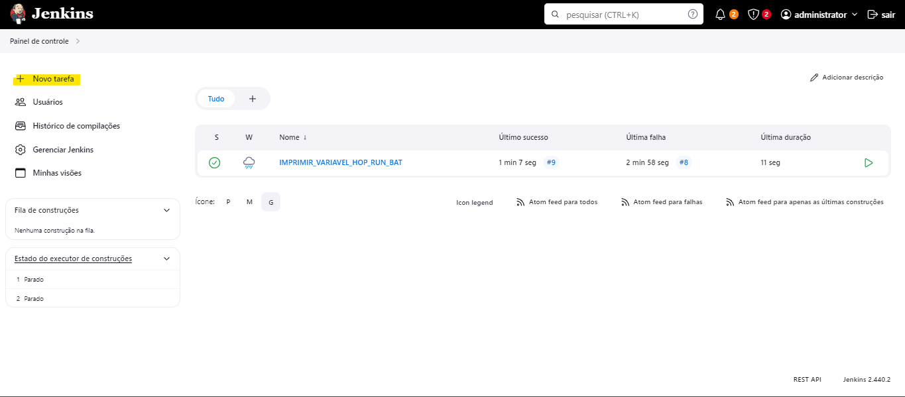

Informe o `Nome` da Tarefa, clique em `Construir um projeto de software de estilo livre` e depois em `Tudo Certo`.

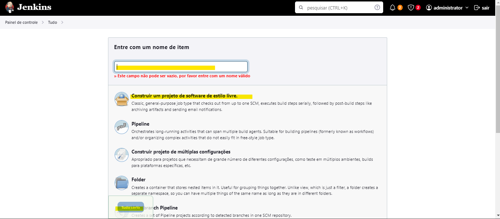

O Jenkins possui muitas configurações e não conseguirei explorar todas aqui.

Vou passar 2 Paraetros que são primordiais para o trabalho com o Apache Hop.

1 - Informar a cada quanto tempo será executado uma tarefas

2 - O Comando de execução

Procure na tela por `Gailho de disparo para contruções` marque a opções `Contruir peruiódicamente` e informe o padrão Cron para agendamento ou um dos exemplos abaixo.


```shell
H/15 * * * *  # Executa o job a cada 15 minutos
H 0 * * *  # Executa o job todos os dias à meia-noite
H 2 * * 0  # Executa o job todos os domingos às 2 da manhã
H 3 1 * *  # Executa o job no primeiro dia de cada mês às 3 da manhã
H 18 * * 1-5  # Executa o job de segunda a sexta-feira às 18:00
30 * * * *  # Executa o job todos os dias a cada hora no minuto 30
H 8 * * 1-5  # Executa o job todos os dias úteis (segunda a sexta-feira) às 8 da manhã
H/5 0-29 * * *  # Executa o job a cada 5 minutos durante os primeiros 30 minutos de cada hora
H/15 9-17 * * 1-5  # Executa o job a cada 15 minutos entre 9 AM e 5 PM de segunda a sexta-feira
H 7 1-5 * *  # Executa o job às 7 AM nos primeiros cinco dias de cada mês
```

Depis procure por `Ambiente de contrução` por `Passos de contrução` por `Adicionar passo de contrução` e escolha para Windows ou Para Linux.

No caso vamos utilizar para `Windows`.

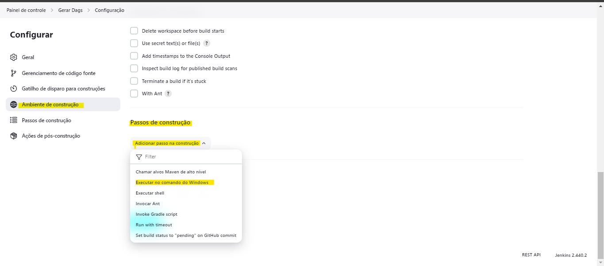

Exemplo de Linha de comando para executar o Apache Hop

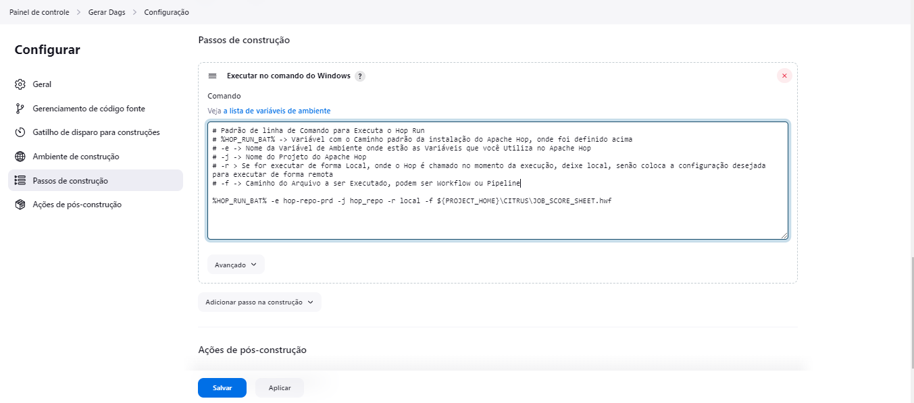


Linha de comando
`%HOP_RUN_BAT% -e hop-repo-prd -j hop_repo -r local -f ${PROJECT_HOME}\CITRUS\JOB_SCORE_SHEET.hwf`

Após todos este procedumentos procure por `Contruir agora` para testar a execução.

Siga estudando o Jenkins, pois ele há muitas opções para explorar.

Ex: Contruir as pipelines via código usando o git como repositório.

**É impossível abordar todos os casos, por isso, estudo bem a ferramenta**

**Estudo também sobre Linux** isso vai lhe ajudar a adiquirir outros conhecimentos que são importantes para manter ferramentas, buscar oturas soluções, implementar novas técnologias.

[Exemplos de Jenkins com Fabricio Veronez](https://www.youtube.com/watch?v=O6y27_Ol25g)

[Linux Tips - Docker](https://www.youtube.com/watch?v=Wm99C_f7Kxw&list=PLf-O3X2-mxDn1VpyU2q3fuI6YYeIWp5rR&pp=iAQB)

[Fullcycle - WSL](https://www.youtube.com/watch?v=O33trWxqVC4&pp=ygUNZnVsbGNpY2xlIHdzbA%3D%3D)

## Em Contrução.

Contruir o Jenkins com Docker e docker-compose